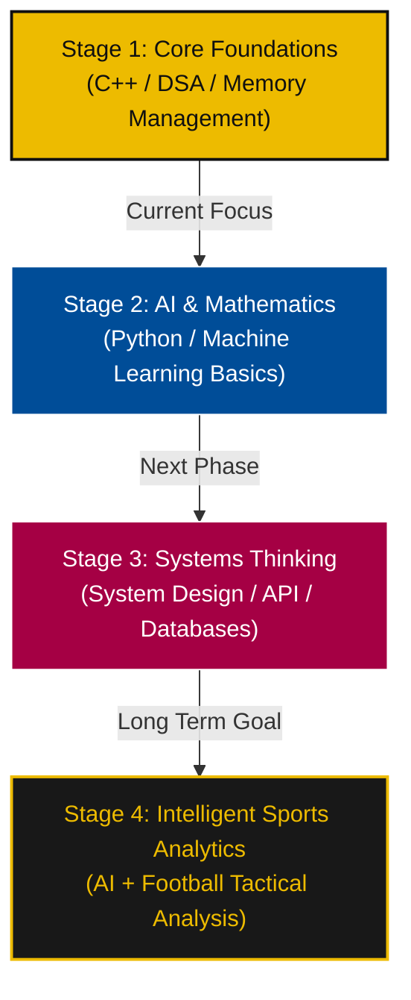

# ⚽ Saiyash Poojari | Portfolio

  
  
  
  
  

  <h3>🔵🔴 Mes que un Developer 🔴🔵</h3>
  
<strong>First-Year B.Tech Student • Systems Engineering • AI & Sports Analytics • C++ Enthusiast</strong>

  
  *Approaching computer science with the tactical discipline of a football playbook—focusing on core logic over quick frameworks.*

---

## 📌 Tactical Overview

I am a first-year B.Tech engineering student focused on building an unshakeable foundation in Computer Science. Instead of rushing to learn the latest high-level abstractions, I believe in **logic over memorization** and **building before consuming**.

- 🏟️ **Current Training Ground:** Mumbai, India
- ⚽ **Tactical Vision:** Integrating Machine Learning and AI with football performance and player positioning analysis (Sports Analytics).
- 🧠 **Playstyle:** Deep systems engineering, efficient memory management, and structured algorithmic problem-solving.

---

## 🛠️ The Playbook (Tech Stack)

Like a manager structuring a team formation, my technical skill set is divided into core tactical zones:

### 🌟 Midfield Control (Current Core)
*The engine room. Dictating the flow of logic, memory, and performance.*
- **C++** (Foundational powerhouse)
- **Data Structures & Algorithms (DSA)**
- **Pointers & Memory Management**
- **Problem Solving & Logic Design**

### 🏃 Wide Attackers (Web Stack)
*Creating impact, visual excellence, and responsive user experiences.*
- **React.js / JavaScript (ES6+)**
- **Tailwind CSS v4**
- **HTML5 & CSS3 (Vanilla)**
- **Framer Motion & GSAP** (Fluid micro-animations)
- **Git & Version Control**

### 🔮 Future Transfers (Future Vision & Sports Tech)
*In scouting phase. Actively learning and developing.*
- **Python / Machine Learning basics**
- **Systems Engineering & Architecture**
- **Sports Analytics & Data Visualization**
- **Statistical Analysis & Advanced Mathematics**

---

## 🏆 Project Showcases (The Matches)

Here is a look at my recent matches and tactical layouts:

### 1. [DEUTSCH MEISTER ⚽](https://deutsch-meister-xi.vercel.app)
*Full-Stack EdTech | Playmaker*
- **Description:** A comprehensive, gamified Duolingo-style learning application designed to guide users from A1 to C2 German proficiency. Features a custom Gemini-powered AI tutor, interactive exercises, and cloud-synchronized progress.
- **Tech Stack:** `React.js`, `Firebase`, `Gemini AI`, `Framer Motion`
- **Action:** [Go To Live Site](https://deutsch-meister-xi.vercel.app)

### 2. [Brain Forge 🧠](https://github.com/saiyash07/BrainForgeAI)
*Full-Stack AI App | Playmaker*
- **Description:** An intelligent, AI-powered learning and knowledge-forging platform that transforms raw concepts into structured study paths. Features a Gemini-powered study assistant, adaptive quizzes, and real-time progress tracking to help users master any subject with precision.
- **Tech Stack:** `React.js`, `Gemini AI`, `Firebase`, `Tailwind CSS v4`
- **Action:** [View Code Repo](https://github.com/saiyash07/BrainForgeAI)

### 3. [Footy Shorts AI 🎬⚽](https://github.com/saiyash07/FootyShorts)
*Sports Tech • Full-Stack | Wide Attacker*
- **Description:** A dynamic short-form video platform built exclusively for football content—goals, skills, tactics, and match highlights. Delivers a TikTok-style vertical swipe experience curated around the beautiful game, with personalised feeds and seamless clip discovery.
- **Tech Stack:** `React.js`, `Firebase`, `Framer Motion`, `JavaScript (ES6+)`
- **Action:** [View Code Repo](https://github.com/saiyash07/FootyShorts)

### 4. [Inventory Management Case Study 📦](https://github.com/saiyash07/InventoryManagementCaseStudy)
*C++ • Systems Design | Tactical Coordinator*
- **Description:** A menu-driven C++ system simulating enterprise inventory control. Manages products, handles stocks dynamically, and reports logs using structures, arrays, and control flow.
- **Tech Stack:** `C++`, `Structures`, `Arrays`, `Control Flow`
- **Action:** [View Code Repo](https://github.com/saiyash07/InventoryManagementCaseStudy)

### 5. [AI Football Analytics 📊](https://github.com/saiyash07/AI-FOOTBALL-ANALYTICS)
*Future Project • Sports Tech | Next-Gen Scout*
- **Description:** A planned machine learning system to analyze player movement, pitch-control maps, and passing networks from match footage and tracking data.
- **Tech Stack:** `Python`, `Machine Learning`, `Computer Vision`, `Data Science`
- **Action:** [View Code Repo](https://github.com/saiyash07/AI-FOOTBALL-ANALYTICS)

---

## 📈 The Journey (Career Roadmap)

---

## 📞 Let's Connect (Send a Pass ⚽)

Whether you want to talk systems engineering, collaborate on sports analytics, discuss data structures, or just chat about the beautiful game—feel free to reach out!

* 📧 **Email:** [poojarisaiyash@gmail.com](mailto:poojarisaiyash@gmail.com)
* 💼 **LinkedIn:** [Saiyash Poojari](https://www.linkedin.com/in/saiyashpoojari/)
* 📸 **Instagram:** [@saiyaas.hh](https://www.instagram.com/saiyaas.hh/)
* 📱 **Phone:** [+91 84540 34440](tel:8454034440)
* 📍 **Location:** Mumbai, India

  Built with 💙 ❤️ and 💛 by Saiyash Poojari

